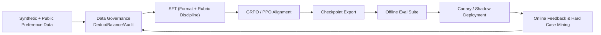

# RM-R1 项目完整技术链路笔记（造数 / 训练 / 微调 / 架构 / 改进）

## 1. 项目目标与方法论
这个项目本质上是在做一个 **Reasoning Reward Model（ReasRM）**：  
不是直接输出一个标量分数，而是让模型先“评审式推理”，再输出偏好标签 `<answer>[[A/B]]</answer>`。  
训练范式是：**偏好数据 + GRPO（PPO 变体）强化微调**，且当前配置是 **跳过 SFT，直接 RLVR**。

一句话概括链路：  
**LLM 造偏好样本 -> 合并切分 ->（可选）注入系统提示词 -> veRL + Ray + vLLM 做 GRPO 微调 -> 导出模型推理。**

---

## 2. 端到端链路总览
1. 造数：`generate_customer_service_data.py` 多线程调用 LLM，生成客服 A/B 对比样本。  
2. 数据整备：`merge_and_split_dataset.py` 合并多个 JSONL，打乱、切分 train/test。  
3. 提示词注入（可选）：`src/model/prompt_template.py` 给每条样本 prepend system prompt。  
4. 训练入口：`scripts/rlvr/local/train_rm_r1_rlvr_dpsk_distilled_7b.sh` 启动 Ray + Hydra 配置覆盖。  
5. 训练主流程：`src/training/rl_trainer.py` 动态加载奖励函数，组装 Actor/Critic/Ref，启动 `RubricRMRayPPOTrainer.fit()`。  
6. 数据加载：`src/data/rl_dataset.py` 读取 JSONL，映射到 `context_messages + winner`，套 chat template 后 tokenization。  
7. 奖励计算：`src/reward/base_reward.py` 只检查输出尾部是否包含正确 `<answer>[[A/B]]</answer>`。  
8. 推理验证：`src/model/inference.py` 加载导出的 HF 模型，给定 A/B 回答并生成最终判定。

---

## 3. 造数链路（Synthetic Data Generation）
### 3.1 数据格式
每条样本结构：
- `context_messages`: 单轮 user message，内部拼接 `[客户问题]`、`[客服A回答]`、`[客服B回答]`
- `winner`: `model_a` 或 `model_b`

这与训练数据集类 `RubricRMDataset` 的读取逻辑完全对齐（它直接读取 `context_messages` 和 `winner`）。

### 3.2 造数策略
`generate_customer_service_data.py` 的设计要点：
- 场景多样化：物流、售后、支付、地址修改、价格争议等 15 类。  
- 风格对比：A 偏“机械模板化”，B 偏“有同理心+解决导向”。  
- 反长度偏置：强约束 A/B 长度接近，并随机注入“好回答略短/略长”的策略。  
- 标签去位置偏置：50% 概率交换 A/B 并同步翻转 winner。

### 3.3 质量与分布（当前仓库实测）
- `train.jsonl`: 3000 条，`model_a=1447`，`model_b=1553`（48.23% / 51.77%）  
- `test.jsonl`: 400 条，`model_a=195`，`model_b=205`（48.75% / 51.25%）  
- A/B 回答平均长度都约 84 字，长度偏置已基本受控。

### 3.4 主要风险
1. 单一教师模型造数，易把教师偏好“蒸馏”进标签。  
2. 标签语义接近“服务风格优先”，真实性与可执行性维度权重不足。  
3. 当前没有自动去重、近重复检测、hard negative 挖掘。

---

## 4. 训练与微调链路（GRPO）
### 4.1 训练启动（Shell 层）
`scripts/rlvr/local/train_rm_r1_rlvr_dpsk_distilled_7b.sh` 做了三件事：
1. 配置基础超参（LR、batch、max prompt/response、GPU 利用率等）；  
2. 启停 Ray 集群；  
3. 调 `python -m src.training.rl_trainer` 并通过 Hydra 覆盖配置。

### 4.2 训练组件（Runtime 层）
`src/training/rl_trainer.py` 里组装核心角色：
- ActorRollout（策略模型 + 采样）
- Critic（价值网络）
- RefPolicy（参考策略，用于 KL）
- Reward（当前是函数型 reward，不启用独立 RM 模型）

后端是 FSDP + vLLM rollout（配置中 `rollout.name=vllm`）。

### 4.3 数据到梯度更新（关键闭环）
1. DataLoader 从 JSONL 取样本。  
2. tokenizer `apply_chat_template(..., add_generation_prompt=True)` 形成模型输入。  
3. policy 生成评审文本。  
4. reward 函数解析生成结果，给出 +1/-1。  
5. GRPO/PPO 根据 reward + KL + value loss 更新参数。  

这是标准的 **on-policy RLHF/RLAIF 风格更新**，区别在于奖励来自“是否判对 A/B”。

### 4.4 微调范式说明
本项目“微调”目前等价于 **RL 微调（GRPO）**，并非 LoRA-SFT。  
也就是说：当前没有单独的 SFT 阶段去先教模型稳定输出结构，再做 RL。

---

## 5. 架构解析（Staff 视角）
### 5.1 架构优点
1. 训练数据结构简单，工程路径短，迭代速度快。  
2. 输出显式推理结构，可解释性优于纯打分 RM。  
3. 通过 A/B 交换减少位置偏置。  
4. 基于 veRL/Ray/vLLM，具备扩展到多机多卡的工程基础。

### 5.2 当前关键短板
1. 奖励过于稀疏：`lm_as_judge.py` 仅检查末尾标签，reward 信息密度很低。  
2. 奖励可被“格式投机”：模型可只学会输出标签，不一定学会高质量评审。  
3. 训练脚本把 `EVAL_TASK` 指向 `train.jsonl`，验证失真。  
4. 数据有 `_with_sys` 版本，但训练脚本默认使用未注入 system prompt 的版本，训练/推理模板可能漂移。  
5. `demo/convert_fsdp_to_hf.py` 当前“合并”逻辑仅取 rank0 state_dict，严格说不是正确的 FSDP full merge。  
6. 缺少系统化评测集分层（in-domain / OOD / 对抗样本 / 长上下文）。

---

## 6. 建议的改进方案（按优先级）
### P0（必须先做）
1. 修正验证集：`EVAL_TASK` 改为 `test.jsonl` 或 `test_with_sys.jsonl`。  
2. 统一模板：训练和推理统一使用同一 system prompt 版本（建议全量迁移到 `_with_sys`）。  
3. 强化奖励函数：  
   - 严格 XML/Tag 解析；  
   - 错误格式给惩罚；  
   - 正确标签 + 正确结构双重奖励（dense reward）。

### P1（1-2 周）
1. 引入 **两阶段训练**：SFT（结构与格式稳定）-> GRPO（偏好对齐）。  
2. 加数据治理：近重复去重、冲突标签审计、长度和类别分层采样。  
3. 增加 hard cases：A/B 都不错、A/B 都很差、长度反直觉样本、防模板投机样本。

### P2（2-4 周）
1. 奖励模型化：从函数奖励升级为可学习 RM（pairwise Bradley-Terry 或 margin loss）。  
2. 多评审器集成：LLM-as-judge + rule-based checker + consistency check。  
3. 评估体系升级：  
   - 离线准确率（A/B 判别）  
   - 校准度（置信与正确性一致性）  
   - 稳定性（同义改写不翻转）  
   - 安全性（敏感场景鲁棒性）

---

## 7. 推荐目标架构（可演进）

这会把当前“一次性训练脚本”升级为可闭环持续优化系统。

---

## 8. 落地执行清单（建议）
1. 先改训练脚本的数据路径与验证集路径，并固化 config 快照。  
2. 升级 `lm_as_judge.py` 为结构化 dense reward（格式、判定、解释质量多分量）。  
3. 增补一个 `eval/` 目录，放固定测试集和自动评测脚本。  
4. 重写 FSDP 导出脚本，使用正确的 state dict gather 流程。  
5. 建立每次训练的 model card：数据版本、配置哈希、评估结果、失败样例。

---

## 9. 结论
当前项目已经具备一个可运行的 ReasRM 原型闭环，并且在“客服偏好判别”上工程路径清晰。  
但从生产级 ML 系统角度，它仍处于 **PoC -> 可复用训练系统** 的中间阶段。  
最值得优先投入的不是“再跑更多 step”，而是：
- **奖励函数信息密度升级**
- **训练/评估协议一致化**
- **数据治理和评测体系工程化**

这三件事做完，模型质量和可维护性会比单纯调参提升更快、更稳。
